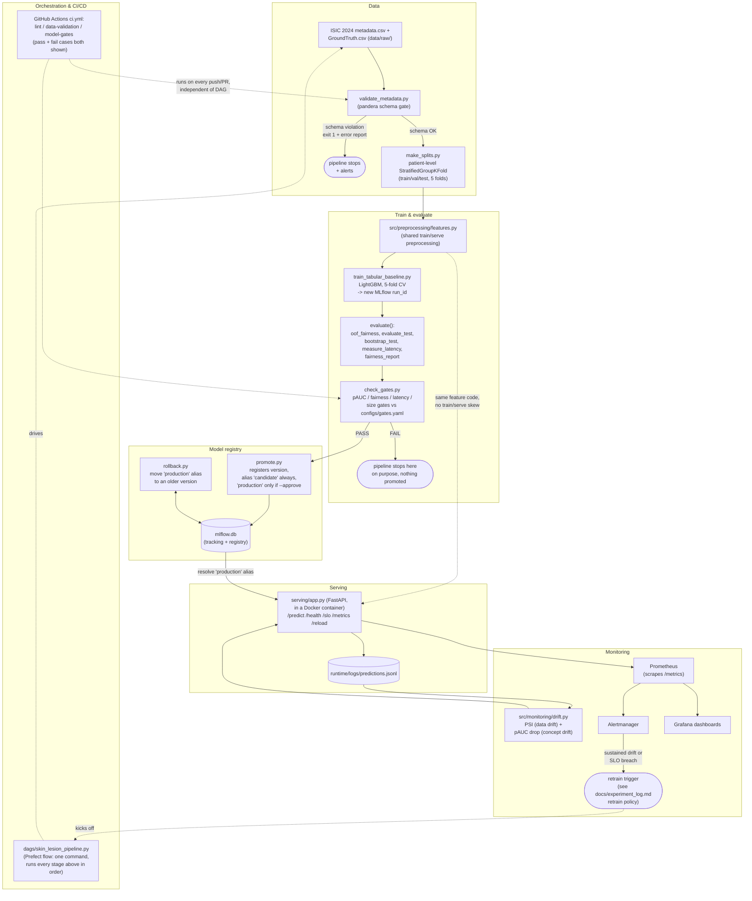

# Architecture

## Reading the diagram

- **Data → Train → Registry → Serve → Monitor** is the main left-to-right
  path every prediction/retrain goes through.
- The two **"pipeline stops"** boxes are deliberate: a bad input file never
  reaches training (data-validation gate), and a bad model never reaches
  `production` (quality gate) -- both exit non-zero, which is what makes
  them real stops rather than warnings, whether run by hand, by the DAG, or
  by CI.
- **`src/preprocessing/features.py`** is shared, unchanged code between the
  training path and the serving path (dotted line) -- this is the
  training/serving-skew prevention mechanism, not just a convention.
- **Monitoring** reads the *live* traffic log the API itself writes, so
  drift detection doesn't need a second data pipeline.
- **Orchestration (Prefect)** and **CI/CD (GitHub Actions)** both wrap the
  same underlying scripts but serve different purposes: the DAG is "run the
  whole thing end to end from raw data to a registered candidate with one
  command"; CI is "catch a regression on every push/PR" and runs much
  faster because it checks a small committed snapshot
  (`reports/gate_snapshot.json`) instead of the full pipeline.

A rendered PNG/SVG export of this diagram (for the slide deck, where
Mermaid won't render) can be made with the `mermaid-cli` package
(`npx @mermaid-js/mermaid-cli -i docs/architecture.md -o architecture.png`)
or by pasting the block above into <https://mermaid.live>.
